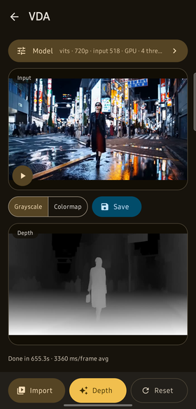
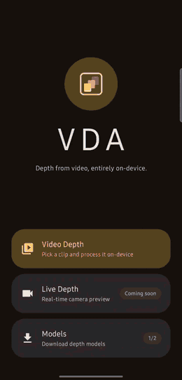
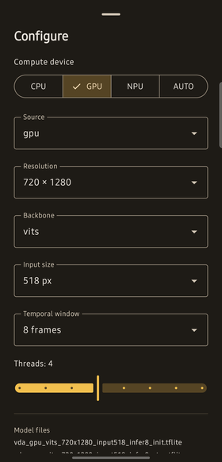

# On-Device Video Depth Anything

**Temporally consistent video depth estimation that runs entirely on an Android phone.**

This project takes [Video Depth Anything (VDA)](https://github.com/DepthAnything/Video-Depth-Anything) —
a streaming, transformer-based monocular depth model — converts its PyTorch checkpoint into a
pair of TensorFlow Lite / LiteRT graphs that a mobile GPU can execute end to end, and ships an
Android app that runs them locally to turn any video into a depth video. No frame ever leaves the
device; the network is used only once, to fetch the model weights.

<p align="center">
  
</p>
<p align="center"><em>Input (left), grayscale depth (middle) and inferno colormap (right), produced on-device from one 13-second clip in a single pass.</em></p>

<p align="center">
  
  
  
</p>
<p align="center"><em>Home &middot; grayscale depth (near is bright) &middot; inferno colormap (near is yellow, far is purple).</em></p>

### The whole pipeline, on-device

<p align="center">
  <a href="vdaDocumentation/video/vda-walkthrough.mp4">
    
  </a>
</p>
<p align="center">
  <em>Pick a clip &rarr; a 195-frame run (collapsed here) &rarr; grayscale and colormap depth, played in sync with the input, then saved.<br />
  Recorded on a Galaxy S23 FE; other people's thumbnails in the system picker are blurred.</em><br />
  <a href="vdaDocumentation/video/vda-walkthrough.mp4"><strong>▶ Full walkthrough (0:28)</strong></a> — the same run with every idle frame removed: the 10-minute
  processing pass (<code>Done in 614.8s · 3152 ms/frame avg</code>) shows only the frames where the progress bar moved.
</p>

---

## Contents

- [Why this exists](#why-this-exists)
- [Repository layout](#repository-layout)
- [How it works](#how-it-works)
- [Quick start](#quick-start)
- [Pre-converted models](#pre-converted-models)
- [Performance](#performance)
- [The GPU-delegate problem](#the-gpu-delegate-problem)
- [Documentation index](#documentation-index)
- [Known limitations](#known-limitations)
- [Credits and references](#credits-and-references)
- [License](#license)

---

## Why this exists

VDA produces depth maps that are stable over time — surfaces don't flicker from frame to frame the
way they do with a per-image depth model — but it ships as a PyTorch model aimed at desktop GPUs.
Getting it onto a phone raises three separate problems, and this repository solves each in its own
component:

1. **Export.** VDA is a *streaming* model: it keeps a rolling cache of temporal-attention state
   across frames, and its first frame is handled differently from every later one. `torch.export`
   needs static shapes, so the model becomes two graphs (`init` and `step`) with the eight cache
   tensors made into explicit, fixed-shape inputs and outputs.
2. **Acceleration.** A naive TFLite export barely touches the GPU: the upstream graph contains a
   dozen op patterns the TFLite GPU delegate rejects, and because the delegate is all-or-nothing
   once attached, the whole model falls back to the CPU. Worse, once every op *was* delegated the
   GPU silently returned a constant depth map — two independent correctness bugs hid behind
   "100% delegated". Fixing all of this is the difference between ~7 s and ~3 s per frame.
3. **Delivery.** Every model is a ~240 MB pair of files, far too large to bundle into an APK, so
   the app downloads and verifies them at runtime.

The result is a full, reproducible path from an upstream research checkpoint to a signed APK you
can install on a phone.

## Repository layout

The repository is organised as one directory per component. Work happens on a per-component branch
(`application`, `converter`, `documentation`) and lands on `main`, which carries everything:

```
On-Device-Video-Depth-Anything/
├── README.md              # this file — project overview
├── vdaApplication/        # the Android app (Kotlin, Jetpack Compose, TFLite/LiteRT)
├── vdaConverter/          # PyTorch → TFLite conversion, verification and benchmarking toolkit
└── vdaDocumentation/      # shared documentation assets (screenshots used above)
```

| Component | What it is | Start here |
| --- | --- | --- |
| **[`vdaApplication/`](vdaApplication/README.md)** | Android app: pick a video, run VDA over every frame on-device, get a grayscale and an inferno-colormap depth video back, play them in sync with the input and save them to the gallery. | [Developer README](vdaApplication/README.md) &middot; [User guide](vdaApplication/USER_GUIDE.md) |
| **[`vdaConverter/`](vdaConverter/README.md)** | Converts VDA checkpoints to `init`/`step` `.tflite` pairs, verifies each export numerically against PyTorch, and benchmarks it on a real device's CPU and GPU delegate. Vendors upstream VDA plus a GPU-delegate-compatible copy of its model source. | [Converter README](vdaConverter/README.md) |

## How it works

```
  VDA checkpoint (.pth)                                     vdaConverter
        │
        ├─ InitWrapper / StepWrapper   NHWC 0–255 in, depth out, explicit h0–h7 cache tensors
        ├─ video_depth_anything_gpu/   op rewrites for TFLite GPU-delegate compatibility + correctness
        ├─ litert_torch.signature      static shapes; "init" and "step" signatures, one file each
        ├─ compare.py                  gpu source vs. original source, pure PyTorch, max_diff
        ├─ verify.py                   exported .tflite pair vs. PyTorch, per-output PASS/FAIL
        └─ benchmark/                  on-device CPU + GPU timings via adb
        │
        ▼
  2 published model pairs  ──►  GitHub release `models-v1`
        │
        ▼                                                   vdaApplication
  ModelDownloader → ModelStore (filesDir/models/, size-verified, pairs installed atomically)
        │
        ▼
  Controller: for each frame ──► VideoFrameDecoder
                                      │
                                      ▼
                             DepthModule (TFLite interpreter, GPU/NNAPI/CPU)
                             frame 1 → init graph (seeds caches h0–h7)
                             frame n → step graph (reads caches, writes updated caches)
                                      │
                                      ▼
                            depth map, normalised per frame
                             ┌────────┴────────┐
                             ▼                 ▼
                         grayscale        inferno colormap
                             └────────┬────────┘
                                      ▼
                          2 × VideoFrameEncoder → 2 output videos
```

Each frame is decoded, run through the model, rendered two ways and written to two encoders in a
**single decode/inference pass**. VDA is streaming, so the eight temporal-attention caches produced
by one frame are fed back as inputs to the next — that is what keeps the depth temporally stable
instead of re-estimating it from scratch every frame. The very first frame of a run goes through
the `init` graph, which seeds the caches; every later frame goes through `step`, and the `init`
interpreter is released once it has done its one job. Every stateful native resource (the
interpreters and their GPU delegate, each `MediaCodec`/`MediaMuxer`, the decoder) is confined to
its own dedicated thread, because none of them are safe to drive from more than one.

## Quick start

### I just want to use the app

Download **[`vda-1.0.apk`](https://github.com/Hardikagrwl03/On-Device-Video-Depth-Anything/releases/download/app-v1.0/vda-1.0.apk)**
from release [`app-v1.0`](https://github.com/Hardikagrwl03/On-Device-Video-Depth-Anything/releases/tag/app-v1.0)
and open it on your phone.

| | |
| --- | --- |
| Version | 1.0 (`versionCode` 1) |
| Requires | Android 15+ (`minSdk 35`), 64-bit ARM (`arm64-v8a`) |
| Size | 210 MB APK, plus ~246 MB of models downloaded on first launch |
| SHA-256 | `d50de2321f9391984c654fa1bc9d554f6463b7cb903a707a6f35215b038ede79` |

The APK contains no model weights — **use Wi-Fi on the first launch.** The app becomes usable as
soon as the default model pair lands. Input clips must be **landscape 1280×720** (see
[Known limitations](#known-limitations)). Full walkthrough, with every setting explained:
**[`vdaApplication/USER_GUIDE.md`](vdaApplication/USER_GUIDE.md)**.

| Import a clip | Run | Pick a model |
| :---: | :---: | :---: |
|  |  |  |

| Depth screen | Model settings |
| :---: | :---: |
|  |  |

### I want to build the app

```bash
git clone git@github.com:Hardikagrwl03/On-Device-Video-Depth-Anything.git
cd On-Device-Video-Depth-Anything/vdaApplication
./gradlew assembleDebug
```

Open the folder in Android Studio, or use the wrapper directly. You need JDK 11, the Android SDK
(`compileSdk 37`), and an `arm64-v8a` device or `x86_64` emulator on API 35+. No model files are
needed at build time. Details, release signing and ABI packaging:
**[`vdaApplication/README.md`](vdaApplication/README.md)**.

### I want to convert or re-export the models

```bash
cd On-Device-Video-Depth-Anything/vdaConverter
conda env create -n vda-convert -f environment.yaml && conda activate vda-convert

# fetch the upstream checkpoints into Video-Depth-Anything/checkpoints/, then:
./run.sh --variant vits --source gpu --backend gpu   # convert → compare → verify → benchmark → visualize
```

`run.sh` chains the whole pipeline for one variant and handles both halves of the pair; each stage
is also available on its own (`scripts/convert.sh`, `compare.sh`, `verify.sh`, `benchmark.sh`,
`visualize.sh`). Details: **[`vdaConverter/README.md`](vdaConverter/README.md)**.

## Pre-converted models

Two model pairs — four files — are published on the GitHub release
**[`models-v1`](https://github.com/Hardikagrwl03/On-Device-Video-Depth-Anything/releases/tag/models-v1)**,
both ViT-S at `720×1280`:

```
vda_<source>_<backbone>_<height>x<width>_input<inputSize>_infer<inferLen>_<init|step>.tflite
```

| Source | Backbone | `init` | `step` | Pair | GPU delegate |
| --- | --- | ---: | ---: | ---: | --- |
| `gpu` | ViT-S | ~121 MB | ~124 MB | ~246 MB | ✅ full |
| `original` | ViT-S | ~116 MB | ~116 MB | ~233 MB | ❌ CPU only |

- A "model" is always a **pair** of files. The `init` graph takes the first frame alone and seeds
  the caches; the `step` graph takes every later frame plus the caches. Neither is usable without
  the other, so the app downloads and installs them as one unit.
- **`source`** is *which copy of the VDA PyTorch source the model was traced from*, decided at build
  time — `gpu` rewrites every op the GPU delegate can't run (and one it runs *wrongly*), `original`
  is the unmodified upstream graph. This is **not** the same thing as the compute device chosen at
  runtime; the `original` build exists as a numerical and performance baseline, not for production
  use.
- **`input518`** is VDA's internal working resolution (the short side is resized to 518 before the
  ViT; at `720×1280` that is 518×924), and **`infer8`** is the temporal window baked into the cache
  tensors — each step attends over the previous 7 frames.
- `vitb`/`vitl` are not published yet; they would slot into the same filename pattern.

The app downloads these URLs directly and, since the release publishes no checksums, verifies each
file against a hardcoded byte size in `ModelManifest.ALL`. The same files are also mirrored on
[Google Drive](https://drive.google.com/drive/folders/1kYM5fFGPH9slXKdKNDpb28LuaFczSPj9?usp=sharing).

## Performance

**Raw inference**, measured with TFLite's `benchmark_model` on a Galaxy S23 FE (`SM-S711B`),
`720×1280` input, ViT-S, average over 10 runs with op profiling enabled
(`benchmark/benchmark_{cpu,gpu}.sh`). Every log is committed under `vdaConverter/benchmark/`:

| Source | Graph | CPU (XNNPACK) | GPU delegate | Speed-up |
| --- | --- | ---: | ---: | ---: |
| `gpu` | `init` | 6.43 s | **2.89 s** | 2.2× |
| `gpu` | `step` | 6.98 s | **3.16 s** | 2.2× |
| `original` | `init` | 6.60 s | ❌ fails to initialise | — |
| `original` | `step` | 7.27 s | ❌ fails to initialise | — |

Two caveats on the GPU column. First, `benchmark_model` runs the delegate at its default,
FP16-allowed precision; the app has to force FP32 for correct output (see below), which costs
roughly **+35–40 %** latency. Second, these are steady-state numbers on a device that had already
warmed up — the converter's own best runs on a cool device were 1.38 s (`init`) and 1.52 s (`step`),
with run-to-run variance in the single milliseconds, which is itself the signature of an
uninterrupted GPU pipeline.

**End-to-end in the app** (decode + inference + render + two encodes per frame), Galaxy S23 FE,
`720×1280` input, `gpu` source, ViT-S:

| Compute device | Per frame (steady state) | 13 s clip (195 frames) |
| --- | --- | --- |
| GPU delegate, FP32 | ~2.2 s at the start, rising to ~4.5 s as the SoC throttles | **10.2 min** (3152 ms/frame average) |
| CPU (XNNPACK, 4 threads) | ~8.5 s | ~28 min |

The GPU row is a measured run — the app's own completion strip reported
`Done in 614.8s · 3152 ms/frame avg`; the full walkthrough video above is that exact run.
Seeding the caches with the `init` graph costs a further ~7 s once per run. This is a ViT-based
model at 720p with eight attention caches carried per frame — it is an order of magnitude heavier
than a matting or segmentation network, so budget minutes, not seconds, and start with clips of a
few seconds.

## The GPU-delegate problem

This is the core technical finding of the project, and the reason `vdaConverter` carries two copies
of the VDA model source.

`Video-Depth-Anything/video_depth_anything/` is kept byte-identical to upstream and is never
edited. `Video-Depth-Anything/video_depth_anything_gpu/` is a parallel copy where the ops below are
rewritten, each confirmed by `compare.py` against the original in pure PyTorch. There were two
distinct failure modes, and they needed two distinct kinds of fix.

### 1. Ops the delegate refuses

Several idiomatic PyTorch patterns decompose, under `torch.export`'s TFLite lowering, into ops that
the TFLite **GPU delegate** does not implement — even though they run fine on CPU via XNNPACK. And
the delegate is not gracefully partial: on the upstream graph it claims 127 of 1338 nodes, then
fails outright with `TfLiteGpuDelegate Prepare: delegate is not initialized`, and the whole model
falls back to the CPU.

| File | Rejected as | Rewrite |
| --- | --- | --- |
| `dinov2.py` | `CONCATENATION: Expected a 4D tensor … but got 1x1x384` — fatal, killed delegate init | route the `cls_token` concat through an explicit 4D shape |
| `dinov2_layers/attention.py` | rank-5 qkv pack ⇒ `SLICE` v5 / `TRANSPOSE` v4 (delegate max 2 / 1) | split the projection before reshaping to heads, keeping every intermediate ≤ 4D |
| `attention.py`, `mlp.py` | `MUL: Doesn't support broadcasting` — LayerScale, fencing off the whole backbone | apply `proj`/`fc2` as 1×1 convs (`linear_as_conv1x1`) — **102 → 836 delegated nodes, 6.6 s → 2.0 s** |
| `motion_module/attention.py` | `DIV: No support of few identical inputs` — softmax over a length-1 sequence lowers to `y/y` | short-circuit: softmax of one logit is exactly 1.0 |
| `motion_module/motion_module.py` | `ADD: Doesn't support broadcasting` — residual adds | apply `to_out[0]` and the feed-forward projection as 1×1 convs |
| `motion_module/motion_module.py` | `GATHER_ND` from `nn.GroupNorm` — an *identity* gather used purely to reshape | normalise without affine params, then scale/shift with an explicit reshape |
| `wrapper.py` (bicubic resize) | `GATHER_ND` + `BROADCAST_TO` from `F.interpolate(mode="bicubic")` | the scale factor is fixed at conversion time, so bicubic is a constant linear operator — factored into two exact 1×1 convolutions (agreement ~`3.6e-7`) |

Every rewrite is exact (`max_diff = 0.000000`) except `linear_as_conv1x1`, which drifts ~`3e-5`
over DINOv2's 12 blocks — floating-point reassociation from differently-blocked CPU kernels, not a
logic difference.

### 2. Fully delegated is not the same as correct

With all of the above in place, both graphs report
`the model graph will be completely executed by the delegate` — and returned a **constant depth
map** (a black video) for any input. Neither `compare.py`, `verify.py`, nor the benchmark's
delegation-coverage numbers can see this, because none of them exercise the real GPU delegate on
real hardware. On-device CPU-vs-GPU tensor bisection traced it to two independent bugs, and both
had to be fixed:

| Bug | Where it's fixed | Fix |
| --- | --- | --- |
| The delegate's `MEAN` kernel mis-reduces the `axis=[0, 2]` pattern `nn.LayerNorm` lowers to — silently returning a too-large variance, no error, no fallback. DINOv2 block 0's `norm1` output alone diverged from CPU by ~14, compounding until the motion modules saturated to NaN. | `vdaConverter` (`gpu` source) | an explicit single-axis `layer_norm()` in `gpu_compat.py`, replacing every `nn.LayerNorm` call |
| The delegate's default **FP16** precision overflows in the motion modules' attention math and produces NaN, regardless of the above. | `vdaApplication` | `TFLiteModelRunner` builds the delegate with `setPrecisionLossAllowed(false)` — a runtime option no `.tflite` file can enforce on its own |

Because the rewrites are numerically exact, a `gpu`-source model is never worse than an `original`
one on any compute device. If a future export ever goes flat, check the output's variance before
believing "fully delegated". The full account, every error message, and the pitfalls that cost the
most time (eager PyTorch shapes are not evidence about the exported graph; small repro scripts
mislead on this problem; the delegate reads a tensor's first dimension as batch size) are in
**[`vdaConverter/README.md`](vdaConverter/README.md)**.

## Documentation index

| Document | Audience | Covers |
| --- | --- | --- |
| [`vdaApplication/USER_GUIDE.md`](vdaApplication/USER_GUIDE.md) | End users | Installing, first launch, making a depth video, saving, every setting explained — no code |
| [`vdaApplication/README.md`](vdaApplication/README.md) | App developers | Architecture, the `init`/`step` module, thread confinement, model-pair delivery, the `source` vs. compute-device distinction, logging, release process |
| [`vdaConverter/README.md`](vdaConverter/README.md) | ML / conversion | `convert.py`, `verify.py`, `compare.py`, benchmarking, op-graph visualisation, the `original`/`gpu` split, the GPU-correctness investigation |
| `.claude/skills/` in each component | Contributors | Fourteen project-scoped Claude Code skills — six for the app (setup, architecture, models, UI, verification, release) and eight for the converter (setup, convert, verify, compare, benchmark, visualize, the GPU-delegate fix recipe, and the GPU-delegate *correctness* recipe) |

## Known limitations

Real constraints of the current pipeline, not bugs to be surprised by:

- **Inputs must be exactly 1280×720 landscape.** The exported graph has fixed shapes and only one
  resolution is published; a clip of any other size is refused up front with a message naming both
  sizes.
- **Outputs carry no audio track** — the encoder writes video only.
- **Depth is normalised per frame, not per clip.** Upstream normalises over the whole video before
  rendering; a single streaming pass can't know the clip's range in advance. Expect some brightness
  shift across hard cuts.
- **Model downloads do not resume mid-file** — a transfer killed with the process restarts that
  file from zero, though a pair interrupted between its two halves resumes at the file boundary.
- **Live Depth (real-time camera depth) is not implemented** — the tile shows a "coming soon"
  toast.
- Processing is offline and slow: budget ~2–4.5 s per frame on the GPU (the phone throttles) and a
  one-off ~7 s to seed the caches, so a 13-second clip takes about 10 minutes.

## Credits and references

This project is an on-device port. All model architecture and training credit belongs to the
original VDA authors:

> **Video Depth Anything: Consistent Depth Estimation for Super-Long Videos**
> Sili Chen, Hengkai Guo, Shengnan Zhu, Feihu Zhang, Zilong Huang, Jiashi Feng, Bingyi Kang
> [arXiv:2501.12375](https://arxiv.org/abs/2501.12375) &middot;
> [Project page](https://videodepthanything.github.io/) &middot;
> [GitHub](https://github.com/DepthAnything/Video-Depth-Anything)

```bibtex
@article{video_depth_anything,
  title   = {Video Depth Anything: Consistent Depth Estimation for Super-Long Videos},
  author  = {Chen, Sili and Guo, Hengkai and Zhu, Shengnan and Zhang, Feihu and Huang, Zilong and Feng, Jiashi and Kang, Bingyi},
  journal = {arXiv:2501.12375},
  year    = {2025}
}
```

The layout of both components, and this document, follows the sibling project
[On-Device Robust Video Matting](https://github.com/Hardikagrwl03/On-Device-Robust-Video-Matting).

Built on [TensorFlow Lite / LiteRT](https://ai.google.dev/edge/litert),
[`litert-torch`](https://github.com/google-ai-edge/LiteRT) for the PyTorch export path,
[Jetpack Compose](https://developer.android.com/compose) and
[Media3](https://developer.android.com/media/media3) on the Android side, and
[netron](https://netron.app/) for op-graph visualisation.

## License

The vendored upstream VDA source under `vdaConverter/Video-Depth-Anything/` is
**[Apache-2.0](vdaConverter/Video-Depth-Anything/LICENSE)**, as published by its authors. The
**ViT-S** checkpoint — the only one converted and shipped here — is also Apache-2.0; note that the
upstream **ViT-B / ViT-L** checkpoints are **CC-BY-NC-4.0**, so converting those would put the
resulting `.tflite` files under a non-commercial license.
