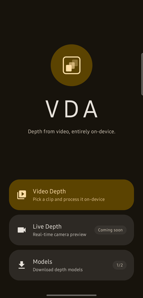
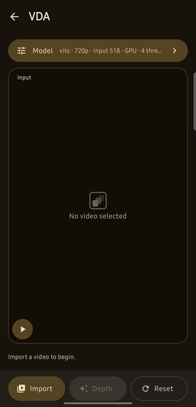
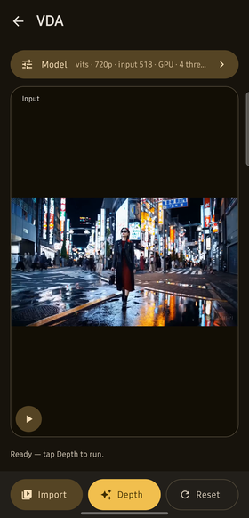
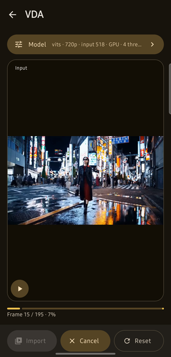
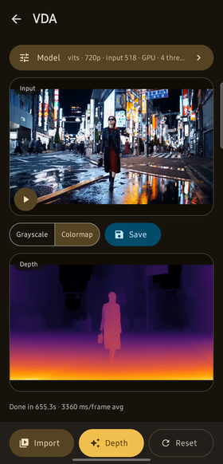
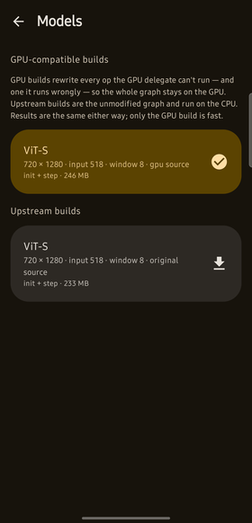

# VDA — User Guide

VDA estimates depth for every frame of a video, entirely on your phone. Nothing you record or
process is ever uploaded — the only thing the app downloads is the AI model itself.

Give it a clip, and you get two videos back:

| Output | What it is |
| --- | --- |
| **Grayscale** | A black-and-white depth map: bright where things are close to the camera, dark where they're far away. |
| **Colormap** | The same depth painted on a heat scale — yellow and orange for near, purple and black for far. Easier to read at a glance, and the one most people want. |

The depth is *consistent over time*: the app carries the model's memory from one frame to the
next, so surfaces don't flicker between frames the way they would if each frame were estimated on
its own.

---

## Contents

- [Installing](#installing)
- [First launch](#first-launch)
- [Making your first depth video](#making-your-first-depth-video)
- [Saving your results](#saving-your-results)
- [Choosing a different model](#choosing-a-different-model)
- [Settings explained](#settings-explained)
- [Good to know](#good-to-know)
- [Troubleshooting](#troubleshooting)

---

## Installing

You'll receive the app as a file named `vda-<version>.apk`. Open it on your phone. Android will
ask you to allow installing apps from your browser or file manager — this is normal for apps not
distributed through the Play Store.

**You need:**

- **Android 15 or newer.** The app won't install on older versions.
- A **64-bit ARM phone** — every phone that runs Android 15 qualifies.
- **About 1 GB free**: ~220 MB for the app, plus ~250 MB for each model you download.
- **Wi-Fi for the first launch** (see below).

---

## First launch



The app needs an AI model before it can do anything, and models are too large to ship inside the
app. So on the very first launch it downloads one automatically — about **246 MB**. Use Wi-Fi.

The model comes as two files that download one after the other; the **Video Depth** tile shows the
combined progress and becomes tappable as soon as the second file lands — a few minutes on a
typical connection. The counter on the **Models** tile (`1/2` above) tells you how many of the two
available models you have.

> **No internet on first launch?** The app won't crash — the Video Depth tile will say *"Tap to
> download a model"* and take you to the Models page, where you can retry once you're connected.

---

## Making your first depth video

### 1. Open Video Depth



*Live Depth* (real-time camera depth) isn't built yet — tapping it just shows a "coming soon"
message.

### 2. Tap **Import** and pick a video

For your first run, **choose something short — 3 to 5 seconds.** Processing takes roughly
**two to four seconds per frame**, so a 5-second clip takes around 5–8 minutes, and a 30-second
clip would take the better part of an hour.

**The video must be landscape 1280 × 720** (720p, wider than it is tall). That's the only size
the model is built for; a clip of any other size is refused with a message showing both sizes.
Once picked, your clip appears in the **Input** panel and the app is ready to run:



### 3. Tap **Depth**



A progress bar shows which frame it's on. The very first frame takes longer than the rest — around
7 seconds — because the model has to build up its memory from scratch. Your screen stays awake for
the whole run.

You can tap **Cancel** to stop early. Leaving the app or letting the screen turn off will
interrupt the run, so it's best to leave it in the foreground.

### 4. Compare the results

| Grayscale | Colormap |
| :---: | :---: |
|  |  |

Your original is on top, the result below. Use the **Grayscale / Colormap** switch to change which
result you're looking at, and press **play** — both videos play together, in sync, so you can
check the depth frame by frame.

The bottom line reports how long the run took and the average time per frame.

---

## Saving your results

Tap **Save**. Both videos are copied into your gallery under **Movies/VDA**, named:

```
VDA_depth_<date>_<time>.mp4
VDA_depth_color_<date>_<time>.mp4
```

> **Save before you move on.** Until you tap Save, results live in temporary storage. Tapping
> **Reset**, running another video, or Android reclaiming space will delete them.

---

## Choosing a different model



Tap **Models** on the home screen. Each entry shows how that model was built and how large it is.
Tap one to download it; it stays on your phone permanently. Downloaded models turn a highlighted
colour with a checkmark.

There is one model family today — **ViT-S**, the smallest of Video Depth Anything's three
encoders — in two variants:

- **GPU-compatible build** (~246 MB) — recommended, and what the app downloads for you. This runs
  entirely on your phone's graphics chip, at roughly **2–4 seconds per frame**.
- **Upstream build** (~233 MB) — the unmodified original model, included for comparison. It
  **cannot** run on the GPU and is forced onto the CPU, at roughly **8 seconds per frame**. **You
  almost certainly want the GPU-compatible one.**

Results are the same either way; only speed differs.

> Downloads continue if you leave the Models page, but **not** if you close the app. If a download
> is interrupted, the file that was in progress starts over from the beginning — though a file
> that had already finished is kept.

---

## Settings explained

Tap the **Model** bar at the top of the depth screen. The sheet scrolls; **Apply** and **Cancel**
are at the bottom.


| Setting | What it does |
| --- | --- |
| **Compute device** | Which chip does the work. **GPU** is fastest and the default. **CPU** is much slower but always works. **NPU** uses the AI accelerator if your phone has a usable one. **AUTO** tries them in order. |
| **Source** | `gpu` or `original` — see [Choosing a different model](#choosing-a-different-model). Stick with `gpu`. |
| **Resolution** | The size the model runs at. Only 720 × 1280 is published today. |
| **Backbone** | The model's encoder. Only `vits` is published today. |
| **Input size** | The size the model shrinks each frame to internally before estimating depth. Only 518 px is published today. |
| **Temporal window** | How many frames of memory the model carries — 8 means each frame is estimated in light of the 7 before it. Only 8 is published today. |
| **Threads** | CPU threads. Only matters when running on CPU. |

Only combinations you've actually downloaded appear here, so you can't pick something that doesn't
exist. Tap **Apply** to load the new model — this takes several seconds while it's set up, and the
sheet stays open with a spinner until it's done.

> If you pick an `original` model together with **GPU** or **NPU**, the app will tell you it's
> switching to CPU. That pairing genuinely cannot run — it's not a bug.

---

## Good to know

- **Everything runs on your phone.** Your videos are never uploaded. The only network use is
  downloading models from GitHub.
- **The output videos have no sound.** Only the picture is processed; audio isn't carried over.
- **Output is always 1280 × 720**, matching the input the model requires.
- **Processing is slow, and that's expected.** Two to four seconds per frame means a
  30-frames-per-second clip takes roughly **1–2 minutes of processing per second of video**.
- **The first frame is the slowest** — about 7 seconds — while the model builds up its memory.
- **Your phone will get warm** during a long run, and slow down as it does — the last frames of a
  long clip can take twice as long as the first. That's normal.
- **The brightness of the depth map is set per frame.** Each frame is stretched so its nearest
  point is brightest and its farthest is darkest. When a scene's depth range changes sharply —
  a cut from a close-up to a wide shot — the overall brightness shifts with it.
- **Models stay downloaded forever.** To reclaim the space, clear the app's storage in Android
  Settings → Apps → VDA → Storage. They'll be re-downloaded next launch.

---

## Troubleshooting

**"The app won't install."**
It requires Android 15 or newer on a 64-bit ARM phone. Older versions of Android are not supported.

**"Video Depth says 'Tap to download a model'."**
No model finished downloading. Tap it to open the Models page, check your connection, and tap the
model with a retry icon.

**"A download failed."**
Failed entries turn red with a circular retry arrow and a reason ("No internet connection",
"Connection timed out", "Not enough storage"). Tap to try again. If it keeps timing out on one
Wi-Fi network but the rest of the internet works, try mobile data or another network — some
networks have trouble reaching the server the model files are hosted on.

**"My video was refused — 'This model runs at 720x1280; the selected video is …'."**
The model only accepts landscape 720p video (1280 wide, 720 tall). Portrait clips, 1080p and 4K
are not supported. Re-export the clip at 1280 × 720 in any video editor and try again.

**"Processing is extremely slow."**
Check the **Model** bar. If it says `CPU`, open the settings and switch **Compute device** to
`GPU` — and make sure **Source** is `gpu`, since `original` models are forced onto the CPU. If it
already says `GPU`, the phone may simply be hot: let it cool down between long runs.

**"The result is completely black."**
This shouldn't happen with the current models. If it does, open the settings, switch **Compute
device** to `CPU`, and run again — if that produces a proper depth map, the problem is with the
GPU on your particular phone; please report which phone you have.

**"The brightness jumps between shots."**
Expected — see [Good to know](#good-to-know). The depth itself is right; only the overall
brightness is re-scaled per frame.

**"My results disappeared."**
They were never saved. Results are temporary until you tap **Save** — see
[Saving your results](#saving-your-results).
